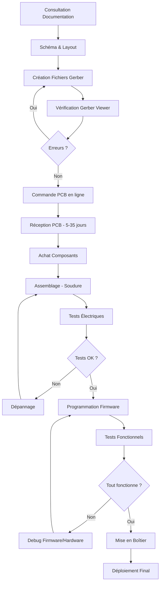

# PCB AepBill Smart System - Documentation Complète

Ce document est votre point d'entrée pour créer le circuit imprimé du système AepBill.

---

## Vue d'Ensemble du Projet

Le **AepBill Smart System** est un système de contrôle intelligent basé sur ESP32, conçu pour gérer des charges électriques avec :
- Interface web HTTPS
- Affichage LCD local
- Horloge temps réel (RTC)
- Contrôle par boutons physiques
- Alarmes sonores (buzzer)
- Relais de puissance pour charges AC

Ce projet transforme le prototype sur breadboard en une carte PCB professionnelle prête à être fabriquée.

---

## Visualisations du PCB

### Vue de Dessus du PCB Assemblé


Le PCB assemblé mesure 100×80mm avec tous les composants soudés. L'ESP32 est au centre-droit, le LCD en haut à gauche, et le relais à droite.

---

### Schéma Électrique


Schéma électrique complet montrant toutes les connexions entre l'ESP32 et les périphériques.

---

### Rendu 3D du PCB


Vue isométrique du PCB assemblé montrant la disposition des composants en 3 dimensions.

---

## Documentation Complète

### 📋 Étape 1 : Planification et Conception

**Avant de commander quoi que ce soit**, consultez ces documents :

1. **[Schéma Électrique](file:///c:/verssion11classicfinaltestee%20-%20Copie/circuit%20et%20montages%20de%20l%27appareil/schema_circuit.md)**
   - Diagramme complet des connexions
   - Détails de chaque sous-système (I2C, relais, boutons)
   - Liste des composants passifs nécessaires
   - Protection et condensateurs de découplage

2. **[Layout PCB](file:///c:/verssion11classicfinaltestee%20-%20Copie/circuit%20et%20montages%20de%20l%27appareil/pcb_layout.md)**
   - Dimensions du PCB : 100×80mm
   - Placement précis de tous les composants
   - Spécifications de routage des pistes
   - Zones haute tension et clearance
   - Export Gerber pour fabrication

3. **[Liste Technique (BOM)](file:///c:/verssion11classicfinaltestee%20-%20Copie/circuit%20et%20montages%20de%20l%27appareil/liste_technique.md)**
   - Bill of Materials complète
   - Tous les composants avec références
   - Connexions GPIO détaillées

---

### 🏭 Étape 2 : Fabrication du PCB

**Commander votre circuit imprimé** :

4. **[Guide de Fabrication PCB](file:///c:/verssion11classicfinaltestee%20-%20Copie/circuit%20et%20montages%20de%20l%27appareil/guide_fabrication_pcb.md)**
   - Comment créer les fichiers Gerber
   - Choix du fabricant (JLCPCB, PCBWay, etc.)
   - Spécifications à sélectionner lors de la commande
   - Vérification des fichiers Gerber
   - Coût estimé : 20-30€ pour 5 PCB livrés
   - Délai : 5-35 jours selon la livraison

> [!TIP]
> Si vous n'avez jamais conçu de PCB, vous pouvez utiliser **EasyEDA** (gratuit, en ligne) pour convertir les schémas en fichiers Gerber, puis commander directement via leur intégration JLCPCB.

---

### 🔧 Étape 3 : Assemblage et Soudure

**Une fois le PCB reçu**, assemblez-le :

5. **[Guide d'Assemblage PCB](file:///c:/verssion11classicfinaltestee%20-%20Copie/circuit%20et%20montages%20de%20l%27appareil/guide_assemblage_pcb.md)**
   - Matériel de soudure nécessaire (fer, étain, pinces)
   - Ordre de soudure recommandé (du petit au grand)
   - Instructions pas à pas pour chaque composant
   - Tests de continuité et vérifications
   - Programmation du firmware ESP32
   - Tests fonctionnels complets
   - Dépannage des problèmes courants

---

### 📡 Étape 4 : Configuration et Déploiement

**Après l'assemblage**, programmez et testez :

6. **[Guide de Rebuild et Flash](file:///c:/verssion11classicfinaltestee%20-%20Copie/circuit%20et%20montages%20de%20l%27appareil/guide_rebuild_flash.md)**
   - Compilation du firmware ESP-IDF
   - Flash avec ou sans chiffrement
   - Configuration Wi-Fi initiale

7. **[Guide de Connexion](file:///c:/verssion11classicfinaltestee%20-%20Copie/circuit%20et%20montages%20de%20l%27appareil/guide_connexion.md)**
   - Se connecter via Wi-Fi (AP ou Station)
   - Accès à l'interface web (mDNS ou IP)
   - Utilisation de l'application Android

---

## Caractéristiques Techniques du PCB

| Spécification | Valeur |
|:--------------|:-------|
| **Dimensions** | 100mm × 80mm (version compacte) |
| **Couches** | 2 (Top + Bottom avec plan de masse) |
| **Épaisseur** | 1.6mm (standard FR-4) |
| **Cuivre** | 1 oz (35µm) |
| **Finition** | HASL ou ENIG |
| **Tension d'alimentation** | 5V DC, 1-2A |
| **Tension de sortie relais** | 220V AC, 10A max (selon module) |
| **Fixation** | 4 trous M3 aux coins |
| **Température de fonctionnement** | 0-50°C (composants standards) |

---

## Liste des Composants Principaux

### Modules

| Composant | Quantité | Notes |
|:----------|:--------:|:------|
| ESP32 DevKit V1 (WROOM-32) | 1 | Microcontrôleur principal |
| Module LCD I2C 1602/2004 | 1 | Affichage local |
| Module RTC DS3231 | 1 | Horloge temps réel avec batterie |
| Module Relais 5V (1 canal) | 1 | Contrôle charge AC/DC |
| Module ACS712 5A | 1 | Capteur de courant (optionnel) |

### Composants Électroniques

| Composant | Quantité | Valeur | Notes |
|:----------|:--------:|:-------|:------|
| Condensateur électrolytique | 2 | 100µF 16V | Filtrage alimentation |
| Condensateur électrolytique | 1 | 10µF 16V | Régulateur ESP32 |
| Condensateur céramique | 3-5 | 100nF 50V | Découplage |
| Diode | 1 | 1N4007 | Protection relais |
| Bouton poussoir tactile | 2 | 6×6mm | Reset/Restart |
| Buzzer actif | 1 | 5V THT | Alarmes sonores |

### Connecteurs

| Composant | Quantité | Type | Usage |
|:----------|:--------:|:-----|:------|
| Header femelle | 2 | 15 pins | Socket ESP32 |
| Header femelle | 3 | 4 pins | LCD, RTC |
| Header femelle | 1 | 3 pins | Relais |
| Bornier à vis | 1 | 2 pôles | Alimentation 5V |
| Bornier à vis | 1 | 3 pôles | Sortie relais (COM/NO/NC) |

**Coût total des composants** : 30-50€ (selon fournisseurs : Aliexpress, Amazon, Mouser)

---

## Workflow de Création Complet



---

## Avantages du PCB vs Breadboard

| Aspect | Breadboard | PCB Professionnel |
|:-------|:-----------|:------------------|
| **Fiabilité** | ⚠️ Connexions instables | ✅ Soudures permanentes |
| **Taille** | ❌ Encombrant (200×150mm) | ✅ Compact (100×80mm) |
| **Durabilité** | ❌ Fils se déconnectent | ✅ Résistant aux vibrations |
| **Aspect** | ❌ Amateur | ✅ Professionnel |
| **Production série** | ❌ Impossible | ✅ Reproductible à l'identique |
| **Coût unitaire** | ~50€ (composants) | ~80€ (composants + PCB) |
| **Coût pour 10 unités** | ~500€ | ~350€ (économie d'échelle) |

---

## Options et Variantes

### Version Compacte (sans ACS712)

Si vous n'utilisez pas le capteur de courant :
- **Dimensions réduites** : 100×80mm au lieu de 100×120mm
- **Coût réduit** : -5€ sur le PCB, -10€ sur les composants
- **Zones supprimées** : U5 (ACS712), J3 (bornier AC input)

### Version avec Assemblage Professionnel (PCBA)

Fabricants comme JLCPCB proposent l'assemblage :
- Vous fournissez : Gerbers + BOM + fichier de placement (CPL)
- Ils soudent automatiquement les composants SMD et THT
- **Coût supplémentaire** : ~20-50€ par PCB
- **Avantage** : Pas besoin de compétences en soudure
- **Idéal pour** : Production >10 unités

---

## Conformité et Sécurité

> [!CAUTION]
> **HAUTE TENSION** : Ce circuit manipule du 220V AC via le relais. Respectez les normes de sécurité :

### Normes Applicables

- **IEC 60950** : Sécurité des équipements de traitement de l'information
- **Clearance** : 3mm minimum entre pistes BT et HT (5mm recommandé)
- **Masque de soudure** : Obligatoire sur les zones HT
- **Boîtier** : Isolation IP20 minimum (IP44+ pour usage humide)

### Usage Recommandé

- ✅ **Usage domestique** : Contrôle de lampes, ventilateurs, appareils <10A
- ✅ **Prototypage** : Tests et développement
- ⚠️ **Usage industriel** : Certification CE/FCC requise
- ❌ **Applications médicales** : Non certifié, ne pas utiliser

---

## Support et Ressources

### Fichiers du Projet

Tous les fichiers sources sont dans :
```
c:\verssion11classicfinaltestee - Copie\circuit et montages de l'appareil\
├── schema_circuit.md          # Schéma électrique complet
├── pcb_layout.md             # Layout et placement composants
├── guide_fabrication_pcb.md  # Commander le PCB
├── guide_assemblage_pcb.md   # Souder les composants
├── liste_technique.md        # BOM (Bill of Materials)
├── guide_montage.md          # Câblage breadboard (référence)
├── guide_connexion.md        # Configuration réseau
└── guide_rebuild_flash.md    # Programmation firmware
```

### Logiciels Recommandés

- **KiCad** (gratuit) : Conception PCB professionnelle
- **EasyEDA** (gratuit en ligne) : Simple pour débutants
- **Gerber Viewer** (en ligne) : Vérification avant commande
- **ESP-IDF** : Compiler le firmware ESP32

### Communautés et Aide

- **Forums ESP32** : [esp32.com](https://www.esp32.com/)
- **KiCad Forums** : [forum.kicad.info](https://forum.kicad.info/)
- **EEVblog** : Aide conception électronique
- **Documentation ESP-IDF** : [docs.espressif.com](https://docs.espressif.com/)

---

## FAQ (Questions Fréquentes)

### Puis-je modifier le PCB pour ajouter des composants ?

Oui ! Le design laisse des GPIO libres sur l'ESP32 :
- **GPIO disponibles** : 0, 2, 4, 5, 12, 13, 14, 15, 17, 18, 19, 26, 32, 33, 35, 36, 39
- Ajoutez des headers pour extensions futures
- Respectez les limitations : GPIO 34-39 (input only), GPIO 0/2 (boot/flash)

### Combien coûte la réalisation complète ?

**Budget total estimé** :
- PCB nu (5 pcs) : 20-30€
- Composants (1 carte) : 30-50€
- Outils soudure (si non équipé) : 30-50€
- **Total première carte** : 80-130€
- **Cartes supplémentaires** : 30-50€ (composants seuls)

### Puis-je utiliser un ESP32 S2/S3/C3 ?

Le design actuel est pour ESP32 WROOM-32 (30 pins). Pour d'autres variantes :
- **ESP32-S2/S3** : Possible, mais pinout différent, nécessite PCB modifié
- **ESP32-C3** : Moins de GPIO, certaines fonctions à retirer
- Recommandation : Restez sur ESP32 WROOM-32 pour compatibilité maximale

### Le PCB est-il compatible avec le firmware actuel ?

**Oui, 100% compatible** ! Le PCB reproduit exactement :
- Les connexions GPIO du breadboard
- L'alimentation 5V DC
- Les modules I2C (même adresses)
- Les boutons et relais

Flashez le firmware sans aucune modification.

### Quelle est la durée de vie du système ?

**Composants critiques** :
- ESP32 : 10-15 ans (usage normal)
- Relais : 100,000 commutations (charge résistive)
- LCD : 50,000 heures (rétroéclairage)
- RTC : 20+ ans (avec pile CR2032 changée tous les 5-10 ans)

**Bon entretien** = durée de vie >10 ans.

---

## Prochaines Étapes

1. **Lisez le schéma électrique** pour comprendre le circuit
2. **Consultez le layout PCB** pour visualiser l'assemblage
3. **Préparez les fichiers Gerber** avec KiCad ou EasyEDA
4. **Commandez le PCB** (JLCPCB recommandé pour débuter)
5. **Achetez les composants** pendant la fabrication du PCB
6. **Assemblez** en suivant le guide étape par étape
7. **Testez** et **déployez** votre système !

---

**Bon courage pour votre projet !** 🚀

Si vous avez des questions ou rencontrez des problèmes, consultez les guides détaillés ou la communauté ESP32.

---

*Documentation créée pour le projet AepBill Smart System v11 Classic*  
*Dernière mise à jour : Décembre 2025*
